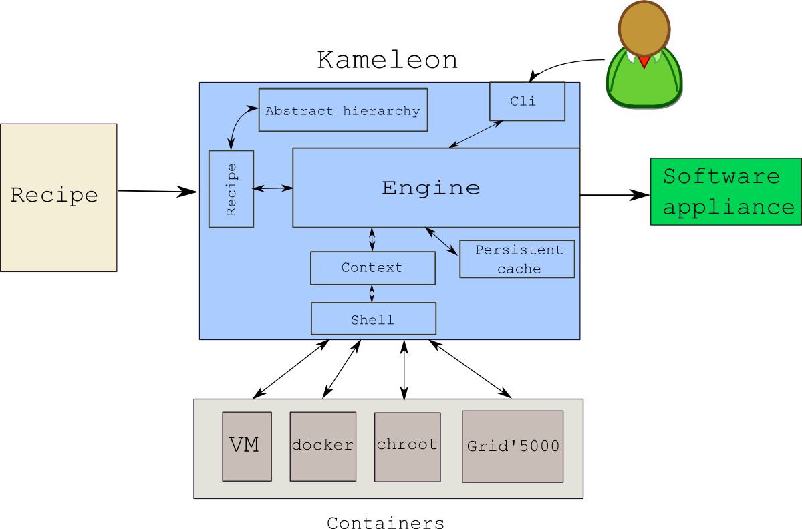
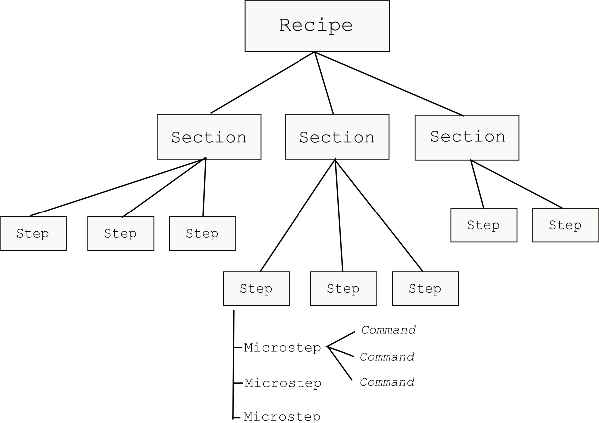
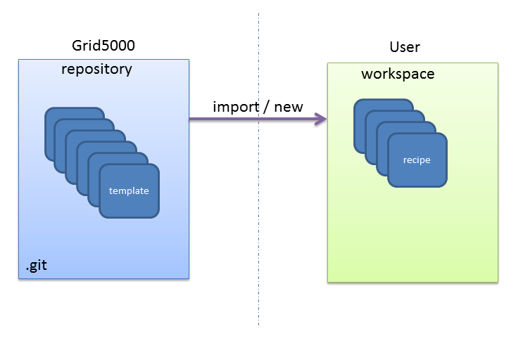

========================
Grid'5000 Admin Tutorial
========================

The tutorial will focus on the three following activities:

* Create and customize G5k appliance as a simple end-user
* Manage a recipe repository
* Share recipes with users

Introduction: What is Kameleon?
--------------------------------

   Kameleon Architecture

Kameleon can be seen as a shell sequencer which will boost your shell scripts.
It is based on the execution of shell scripts but it also provides some syntax sugar
that makes working with shell scripts less painful.

   Kameleon recipe hierarchy

There are two ways you can start working with Kameleon. First, you can manually
write recipes from scratch. Secondly, you can build recipes from existing models.
We are going to focus on the latter in this tutorial. We are going to see how
to create new recipes and share them.

For the purposes of this tutorial, I have already created a Grid5000 environment,
which you can download on the Grenoble site.

.. note::
    ::

      $ oarsub -I -t deploy
      $ kadeploy3 -a /home/sharrache/public/kameleon-demo-env_img.yaml -f $OAR_NODEFILE

Building Debian based appliance as a simple end-user
----------------------------------------------------

Kameleon is delivered without any template by default::

    $ kameleon template list

To begin, a recipe repository has to be added::

    $ kameleon template repo add tutorial https://github.com/oar-team/kameleon-g5k-tutorial.git
    $ kameleon template list

Now, you should see the template list prefixed by the repository name, called "tutorial".

To build a Debian 7 image, it is possible to choose from several virtualization
motors: chroot, qemu, virtualbox

In this tutorial, we are going to choose chroot, but you can also choose virtualbox
or qemu. Let's import the debian7 template in our workspace::

    $ mkdir my_recipes && cd my_recipes  ## create a workspace
    $ kameleon new my_debian7 tutorial/debian7/chroot

This will generate the following files in the current directory::

    create  tutorial/debian7/chroot.yaml
    create  tutorial/debian7/base.yaml
    create  tutorial/steps/aliases/defaults.yaml
    create  tutorial/steps/checkpoints/qcow2.yaml
    create  tutorial/steps/bootstrap/initialize_disk_chroot.yaml
    create  tutorial/steps/enable_checkpoint.yaml
    create  tutorial/steps/bootstrap/debian/debootstrap.yaml
    create  tutorial/steps/bootstrap/start_chroot.yaml
    create  tutorial/steps/setup/debian/configure_apt.yaml
    create  tutorial/steps/setup/debian/upgrade_system.yaml
    create  tutorial/steps/setup/debian/install_software.yaml
    create  tutorial/steps/setup/debian/configure_kernel.yaml
    create  tutorial/steps/setup/debian/install_bootloader.yaml
    create  tutorial/steps/setup/debian/configure_system.yaml
    create  tutorial/steps/setup/debian/configure_keyboard.yaml
    create  tutorial/steps/setup/debian/configure_network.yaml
    create  tutorial/steps/setup/create_group.yaml
    create  tutorial/steps/setup/create_user.yaml
    create  tutorial/steps/disable_checkpoint.yaml
    create  tutorial/steps/export/qemu_save_appliance.yaml
    create  my_debian7.yaml

We have thus the following recipes in our ``workspace``::

    $ kameleon list
    NAME                    | DESCRIPTION
    ------------------------|------------------------------------------------------------
    my_debian7              | <MY RECIPE DESCRIPTION>
    tutorial/debian7/base   | Base template for Debian appliance.
    tutorial/debian7/chroot | Debian 7 (Wheezy) appliance built with chroot and qemu-nbd.

The new recipe ``my_debian7.yaml`` inherits the base recipe
``tutorial/debian7/chroot.yaml`` as we can see in the
``my_debian7.yaml`` file with the keyword ``extend``

.. code-block:: yaml
   :linenos:
   :emphasize-lines: 10,17,20,23

    #==============================================================================
    # vim: softtabstop=2 shiftwidth=2 expandtab fenc=utf-8 cc=81 tw=80
    #==============================================================================
    #
    # DESCRIPTION: <MY RECIPE DESCRIPTION>
    #
    #==============================================================================

    ---
    extend: tutorial/debian7/chroot.yaml

    global:
        # You can see the base template `tutorial/debian7/chroot.yaml` to know the
        # variables that you can override

    bootstrap:
      - "@base"

    setup:
      - "@base"

    export:
      - "@base"

This recipe acts exactly as the parent recipe thanks to the keyword "@base". (see :ref:`inheritance`)

Let's start building the appliance::

    $ kameleon build my_debian7.yaml --enable-cache

We enable caching for all network data that will be used to
build the appliance. Thanks to this, the recipe reconstructability is ensured.

The process will start and take some time...

While waiting, it is possible to analyze all steps and variables contained
the parent recipe ``tutorial/debian7/chroot.yaml``.

.. code-block:: yaml
   :linenos:
   :emphasize-lines: 6,7,15

    export:
      - disable_checkpoint
      - qemu_save_appliance:
        - input: $(readlink $$image_disk)
        - output: $$kameleon_cwd/$$kameleon_recipe_name
        - save_as_qcow2
        - save_as_tar_gz
        # - save_as_qed
        # - save_as_tar_xz
        # - save_as_tar_bz2
        # - save_as_raw
        # - save_as_vmdk
        # - save_as_vdi

When Kameleon ends, a directory called ``build`` will be generated in
the current directory. You will have a debian wheezy appliance in a different
format, that you can try out by executing::

    $ qemu-system-x86_64 -enable-kvm -m 512 -curses build/my_debian7/my_debian7.qcow2

Creating a Grid'5000 environment
--------------------------------

Now, let's customize our recipe to create a Grid'5000 environment. With this
step, we will see how the code can be re-used with Kameleon. Therefore, we can
extend the recipe created earlier.

.. code-block:: yaml
   :linenos:
   :emphasize-lines: 8-37

    export:
      - disable_checkpoint
      - qemu_save_appliance:
        - input: $(readlink $$image_disk)
        - output: $$kameleon_cwd/$$kameleon_recipe_name
        - save_as_tar_gz

      - g5k_custom:
        - kadeploy_file:
          - write_local:
            - $$kameleon_cwd/$$kameleon_recipe_name.yaml
            - |
              #
              # Kameleon generated based on kadeploy description file
              #
              ---
              name: $$kameleon_recipe_name

              version: 1

              os: linux

              image:
                file: $$kameleon_recipe_name.tar.gz
                kind: tar
                compression: gzip

              postinstalls:
                - archive: server:///grid5000/postinstalls/debian-x64-base-2.5-post.tgz
                  compression: gzip
                  script: traitement.ash /rambin

              boot:
                kernel: /vmlinuz
                initrd: /initrd.img

              filesystem: $$filesystem_type

This recipe will generate in the build directory a tar.gz image and a
configuration file for Kadeploy. We have to copy them in a Grid'5000 site for
instance (Grenoble) by doing::

     $ scp my_debian7.tar.gz my_debian7.yaml grenoble.g5k:~/

Therefore, if we log in the respective site, we can then submit a deploy job and
deploy the image using kadeploy::

    user@fgrenoble:~$ oarsub -I t deploy
    [ADMISSION RULE] Set default walltime to 3600.
    [ADMISSION RULE] Modify resource description with type constraints
    Generate a job key...
    OAR_JOB_ID=1663465
    Interactive mode : waiting...
    Starting...

    Connect to OAR job 1663465 via the node fgrenoble.grenoble.grid5000.fr

    user@fgrenoble:~$ kadeploy -a my_debian7.yaml -f $OAR_NODEFILE

The image will be deployed on baremetal after a few minutes...

Manage a recipe repository and share it
---------------------------------------

One key principle that it is essential to know in Kameleon
is the difference between a workspace and a template repository.

To ``convert`` a workspace into a repository, all you need to do is publish it
with git

**Admin 1**::

    $ git init
    $ git remote add origin git@grid5000-recipes
    $ git push

**Admin 2**::

    $ git clone git@grid5000-recipes
    $ cd grid5000-recipes
    $ kameleon build|list|info...

**User**::

    $ kameleon template repository add grid5000 git@grid5000-recipes
    $ kameleon template repository update grid5000
    $ kameleon template list|info|import...

Exercice
--------

1) In the previous recipe ``my_debian.yaml``, find the change to make in order
   to build a 32-bit appliance (and not a 64-bit one). Do no hesitate to look
   at the parent recipes.

2) **Add** a new grid5000 user and add it to the sudo group.

3) Introduce an error in the recipe execution and resolve it in Kameleon
   interactive mode

e.g.

::

    exec_local: cat /non_existing_file

3) Try to build a debian jessie

4) Create a git repository and try to share it with your neighbour.

e.g.

::

    kameleon template repo add <username> root@genepi-9.grenoble.grid5000.fr:/root/my_recipes/.git
    or
    git clone root@genepi-9.grenoble.grid5000.fr:/root/my_recipes/.git <username>
